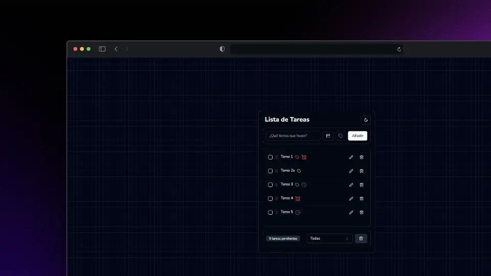

# To-Do App

<p align="center">
  
</p>

## Descripción

La **To-Do App** es una aplicación de gestión de tareas que permite a los usuarios organizar, agregar, y filtrar tareas. La aplicación tiene características de notificación que alertan al usuario cuando una tarea está a punto de vencer, y utiliza un sistema de almacenamiento local para recordar alertas mostradas.

## Características

- Agregar nuevas tareas con fechas de vencimiento.
- Visualizar una lista de tareas con opciones de filtrado.
- Modo claro/oscuro para una mejor experiencia de usuario.
- Notificaciones de tareas que están a punto de vencer (con almacenamiento local para persistencia).
- Interfaz amigable y optimizada para distintos tamaños de pantalla.

## Tecnologías utilizadas

- **React** con **Vite** como entorno de desarrollo.
- **JavaScript/JSX**.
- **Tailwind CSS** para el diseño de la interfaz de usuario.
- **Local Storage** para persistencia de datos de notificaciones.

## Instalación

Sigue los siguientes pasos para clonar y ejecutar la aplicación en tu entorno local:

1. Clona este repositorio:

   ```bash
   git clone https://github.com/WillJkdev/ToDo-App.git
   cd todo-app
   ```

2. Instala las dependencias:

   ```bash
   npm install
   ```

3. Inicia la aplicación:

   ```bash
   npm run dev
   ```

4. Abre tu navegador y navega a `http://localhost:5173` para ver la aplicación en acción.

## Uso

1. **Agregar una tarea**: Ingresa el título de la tarea y la fecha de vencimiento en los campos proporcionados.
2. **Visualizar la lista**: Las tareas se muestran en una lista con un área de desplazamiento.
3. **Notificaciones**: Si una tarea está cerca de vencer (un día antes), se mostrará una notificación que puedes reconocer haciendo clic en "OK".
4. **Filtrar tareas**: Utiliza los filtros para ver tareas completadas, pendientes, o todas.

## Licencia

Este proyecto está licenciado bajo la [Licencia MIT](LICENSE).
